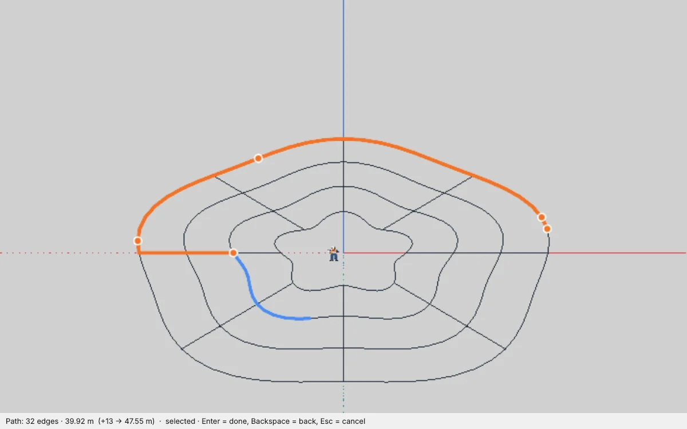

# Path Select — Kantenpfade per Klick auswählen für IngeTrazo

Ein paar Punkte entlang einer Kontur anklicken — der **kürzeste Weg entlang der Kanten** zwischen den Klicks wird ergänzt und ausgewählt, wie bei der «Smart Path Selection» von Profile Builder für SketchUp. Praktisch für Höhenlinien, Umrisse und Wege in importierten Plänen (DXF/DWG/PDF), die aus Hunderten Einzelsegmenten bestehen.

[English → README.md](README.md)

## Installation
1. In IngeTrazo: **Extensions ▸ Open plugins folder** (Windows: `%APPDATA%\ingetrazo\plugins\`, Linux: `~/.local/share/ingetrazo/plugins/`).
2. `path_select_tool.py` in diesen Ordner kopieren.
3. IngeTrazo neu starten → **Extensions ▸ Path Select** (Alt+C).

Benötigt IngeTrazo ≥ 0.5 (Extension-API 2).

## Bedienung
1. **Kante anklicken** — dort beginnt der Pfad.
2. **Maus auf eine andere Kante** — der kürzeste Weg vom letzten Klick bis dorthin wird blau angezeigt.
3. **Klicken** — der Abschnitt wird übernommen (orange). Beliebig oft wiederholen; erreicht der Pfad seinen Anfang, schließt er sich.
4. Der Pfad **ist ab dem ersten Klick die Auswahl**: Ctrl+C, Move oder Delete wirken sofort.
5. **Enter** oder Doppelklick beendet den Pfad; der nächste Klick beginnt einen neuen.

- **Backspace** nimmt den letzten Abschnitt zurück, **Esc** verwirft den Pfad und stellt die vorherige Auswahl wieder her.
- **Ctrl / Shift / Shift+Ctrl** beim ersten Klick fügen den Pfad zur Auswahl hinzu, schalten ihn um oder ziehen ihn ab — wie bei Select.
- Die Statusleiste zeigt Kantenanzahl und Länge, mit Vorschau.
- **Rechtsklick ▸ Select Contour** erweitert die gewählten Kanten entlang ihrer Ketten (bis zur nächsten Abzweigung).
- Das Werkzeug bleibt aktiv, bis ein anderes gewählt wird (Space = Select).

## Änderungen
- **1.0** — erste Veröffentlichung.

## Lizenz
GPL-3.0-or-later · © 2026 Pesi (pesi3d.de) · [Impressum](https://pesi3d.de)

Nicht verbunden mit oder unterstützt von mind.sight.studios oder Trimble Inc.; «Profile Builder» und «SketchUp» werden nur zur Beschreibung des Arbeitsablaufs genannt.
